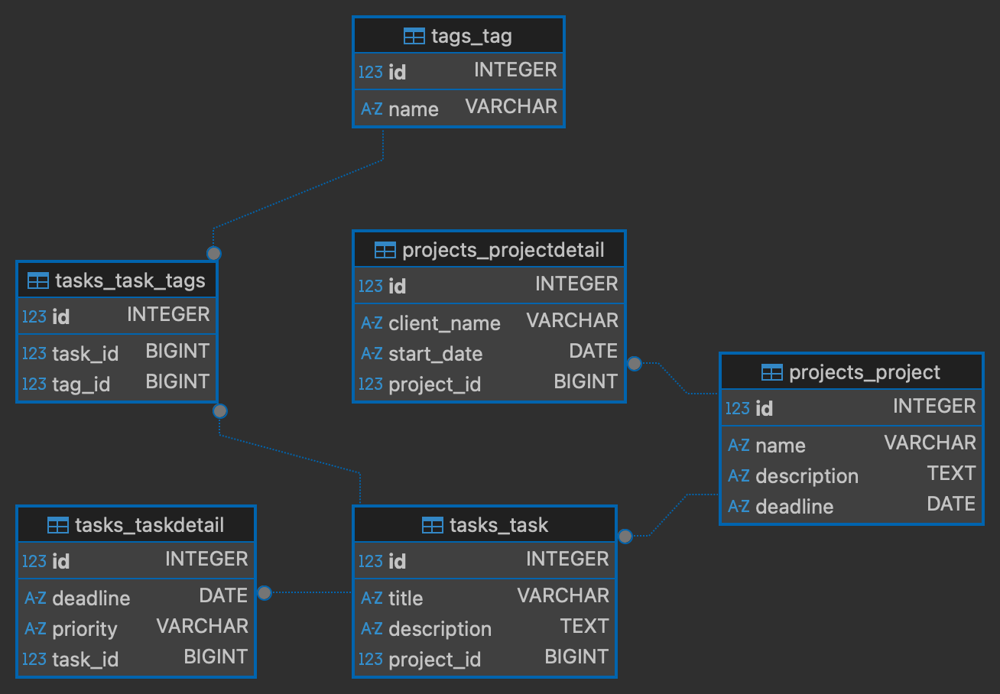

# Django Relational Todo List 🚀

This repository demonstrates a **RESTful API** built with Django, focusing on complex database architecture and clean relational logic.

## 📊 Database Architecture


## 📌 Learning Objectives
- **Modular Architecture:** Separated business logic into `projects` and `tasks` apps.
- **Relational Integrity:** Implemented **Foreign Keys** with `on_delete=models.CASCADE` to ensure data consistency.
- **RESTful API Design:** Developed endpoints using various HTTP methods (GET, POST, PUT, PATCH and DELETE).
- **Database Management:** Schema visualization via **DBeaver** and version control through **Django Migrations**.

## 🛠️ Tech stack
- **Backend:** Python 3.x & Django
- **Database:** SQLite (analyzed via DBeaver)
- **Tooling:** VS Code, Bash CLI, Postman

## 🚀 Getting Started (Local Setup)
1. Clone the repository.
   ```bash
   git clone <your-repository-url>
   cd <your-project-folder>
   ```
2. Create and activate the virtual environment:
   ```bash
   python -m venv venv
   source venv/bin/activate # o .\venv\Scripts\activate su Windows
   ```
3. Install dependencies:
   ```bash
   pip install -r requirements.txt
   ```
4. Initialize the Database:
   ```bash
   python manage.py makemigrations
   python manage.py migrate
   ```
5. Start the development server:
   ```bash
   python manage.py runserver
   ```
6. Testing the API:
   ```bash
   The server will be running at http://127.0.0.1:8000/

   Import the `Todolist API.postman_collection.json` file into Postman to start testing the endpoints immediately.
   ```
## 📡 API Endpoints

### Projects
| Method | Endpoint | Description |
| :--- | :--- | :--- |
| POST | `/projects/add/` | Create a new project |
| GET | `/projects/` | List all available projects |
| DELETE | `/projects/delete/<id>/` | Delete a project and all its associated data |
| POST | `/projects/details/add/` | Add extra details (Client, Start Date) to a project (1:1) |

### Tasks
| Method | Endpoint | Description |
| :--- | :--- | :--- |
| POST | `/tasks/add/` | Create a task linked to a project |
| GET | `/tasks/?project_id=<id>` | List all tasks for a specific project |
| PATCH | `/tasks/update/<id>/` | Partially update task title or description |
| PUT | `/tasks/full-update/<id>/` | Replace an entire task (Full update) |
| DELETE | `/tasks/delete/<id>/` | Remove a specific task |
| POST | `/tasks/details/add/` | Add extra details (Deadline, Priority) to a task (1:1) |

### Tags (Many-to-Many)
| Method | Endpoint | Description |
| :--- | :--- | :--- |
| POST | `/tags/add/` | Create a new tag (e.g., "Urgent", "Work") |
| GET | `/tags/list/` | List all available tags |
| POST | `/tasks/<task_id>/add-tag/` | Attach an existing tag to a specific task |

### Data Integrity Logic (Cascade Deletion)
The project implements a robust "Cascade" logic to maintain database cleanliness:

- **1:N Relationship:** A single Project can contain multiple Tasks.
- **1:1 Relationships:** Projects and Tasks have their own dedicated detail tables.
- **M:N Relationship:** Tasks and Tags are connected through a junction table.

**Automatic Behavior:** When a **Project** is deleted, Django triggers a chain reaction:
1. The **ProjectDetail** linked to it is removed.
2. All **Tasks** belonging to that project are deleted.
3. All **TaskDetails** associated with those tasks are cleaned up.
4. **M:N Junction:** Associations in `tasks_task_tags` are removed, but the **Tags** themselves remain intact (preserving your category list).